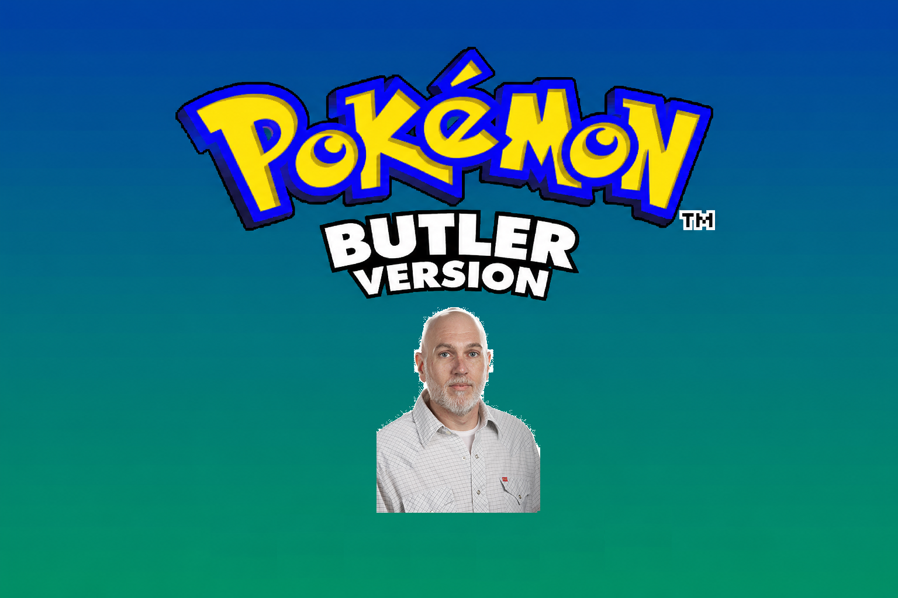
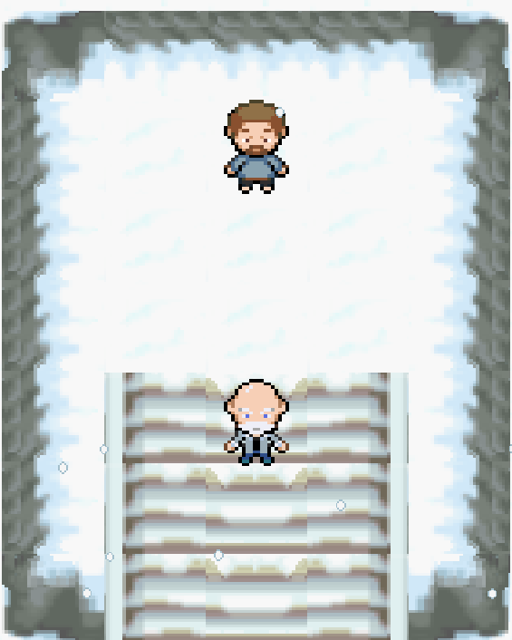
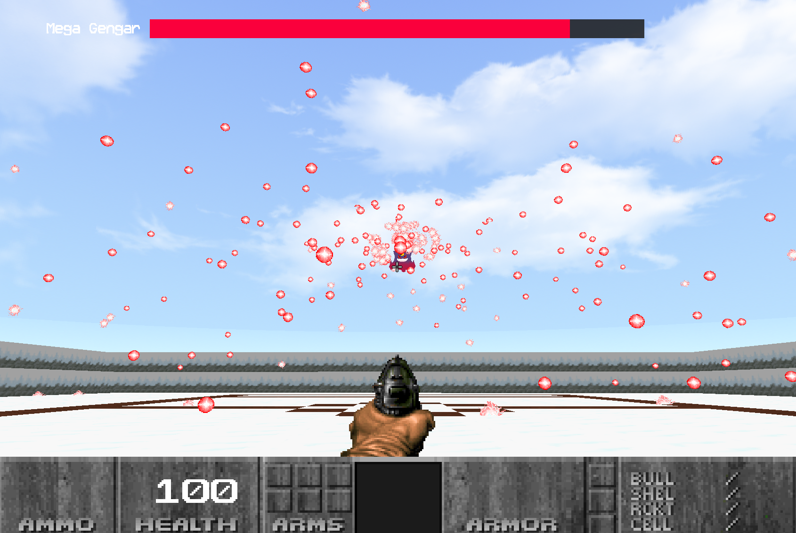

# DOOMENSTEIN

A first-person shooter inspired by bullet hell mechanics. take on a series of progressively difficult bosses and bullet patterns to reach the end of the game. Yes, that one ERROR_AND_DIE is on purpose.

---

# Overview

Professor Butler hates Pokemon because he hates fun. However, professor Squirrel wants to take him on in a Pokemon battle to determine who the best SD professor is once and for all. However, Butler has brought a suprise weapon to the encounter.

  
 \

---
# Controls
## Keyboard
### Attract Controls
Space	= Start Game \
ESC	= Exit Application

### Overwold Controls
W	 = Move Up \
S	= Move Down \
A	= Move Left \
D	= Move Right \
P	= Pause \
ESC	= Return to Start Screen / Quit

### Battle Controls
W	 = Move Forward \
S	= Move Back \
A	= Move Left \
D	= Move Right \
Shift = Sprint \
1 = Equip Pistol \
2 = Equip Plasma Rifle

Mouse = Aim \
Left Click = Shoot

# Features
6 Bosses of Increasing Difficulty \
RPG Overwold movement system \
Pesonally made spritework \
Personally recreated tilesheet \
Boss State Machine System \
Keyboard Support \
Debug Tools for Development

Good luck, soldier. 🫡
